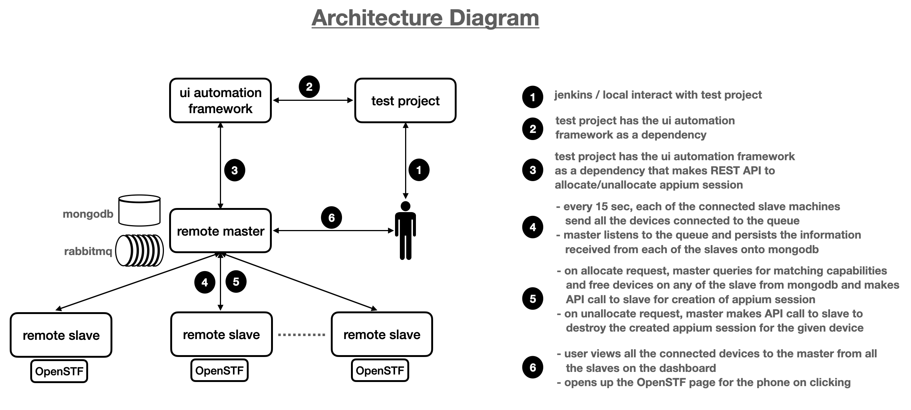
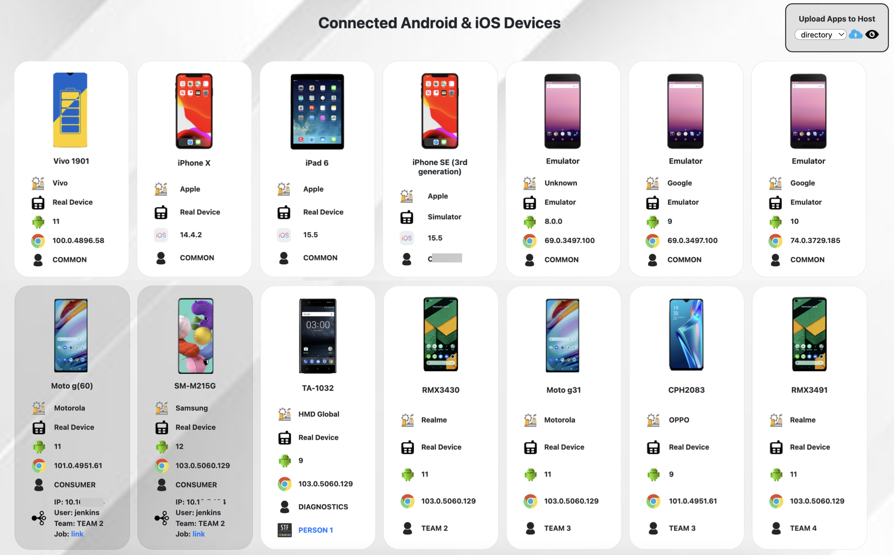
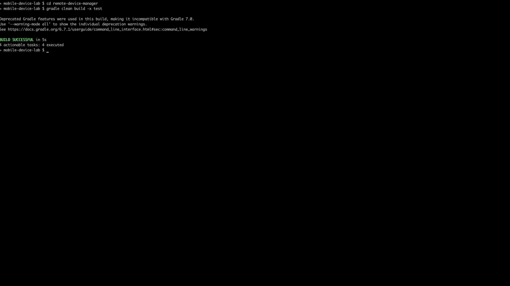

# Lampo - The Mobile Device Lab

**Lampo** is developed to run appium mobile automation scripts on mobile devices connected to remote machines. It also aims at allowing users to interact with remotely connected devices for manual testing.

Here, we have a master-slave architecture where anyone can attach their machines as slaves to master and share their devices with anyone within the organisation to use remotely and all the devices are managed centrally by the master application. These attached devices can be used for both automation and manual testing.


## Design



> **Note**: Master and Slave can be installed in the same machine or separate machines. *It is recommended* to have it on separate machines.

## 1. Install - Master

### Prerequisites

#### Java 8

Please follow the [link](https://www.oracle.com/java/technologies/javase/javase-jdk8-downloads.html) for installing **Oracle JDK 8** or [link](https://adoptopenjdk.net/) for **AdoptJDK**.

#### RabbitMQ

Please follow the [link](https://www.rabbitmq.com/download.html) for installing **RabbitMQ**.


For installation on **Mac**, run the following commands from terminal:

```
brew update
brew install rabbitmq
```

For enabling the **rabbitmq** service to run in background in **Mac**, run the following command:

```
brew services start rabbitmq 
```

Run the following commands to create an user for remote connect:

```
rabbitmqctl add_user connect connect
rabbitmqctl set_permissions -p / connect ".*" ".*" ".*"

```

#### MongoDB

Please follow the [link](https://www.mongodb.com/try/download/community) for installing **MongoDB Community Server**.


For installation on **Mac**, run the following commands from terminal:

```
brew tap mongodb/brew
brew install mongodb-community
```

For enabling the **mongodb** service to run in background in **Mac**, run the following command:

```
brew services start mongodb-community
```

### Building the Master Application

```
cd remote-device-manager && ./gradlew clean build 
```

### Running the Master Application

Once the application is built successfully, **`build/libs/remote-device-manager.war`** will be created. Run the following command to start the master application:

```
java -jar build/libs/remote-device-manager.war
```

> **Note:** Make sure **rabbitmq** and **mongodb** services are up and running.

This command can be run in background using the following command:

```
java -jar build/libs/remote-device-manager.war > master.log 2>&1 < /dev/null &
```

#### Overridable Configurations

All the configurations are present in **`remote-device-manager/src/main/resources/application.properties`**

* **`max_session_duration`** — maximum duration to allow sessions to be allocated in seconds. **Default: 900**
* **`cron.reap_unreachable_slaves`** — to clean up unreachable devices and devices connected to them. **Default: */30 * * * * ?** to check every 30 seconds.
* **`cron.reap_long_running_sessions`** — to clean up allocated sessions running longer than the permitted duration as given by **`max_session_duration`** property . **Default: */30 * * * * ?** to check every 30 seconds.

All the above configurations are be overridden by passing them when launching the application from commandline as well by prefixing **`--`**.

```
java -jar build/libs/remote-device-manager.war --max_session_duration=15
```


## 2. Install - Slave

### Prerequisites

#### Java 8 

Please follow the [link](https://www.oracle.com/java/technologies/javase/javase-jdk8-downloads.html) for installing **Oracle JDK 8** or [link](https://adoptopenjdk.net/) for **AdoptJDK**.

### Android SDK

* Install Android Studio from [https://developer.android.com/studio](https://developer.android.com/studio)
* From SDK Manager → SDK Tools, install Android Emulator, Android SDK Platform-Tools, Android SDK Tools
* From AVD Manager → Create New Virtual Device, if required
Once this installation is done, Android Studio is not required anymore. It can be removed.

Also, make sure **ANDROID_HOME** environment variable is set. To know the path, open Android Studio → Configure (appear on lower bottom corner) → SDK Manager → Copy Android SDK Location

#### Node Version Manager

Please follow the link to install [nvm](https://github.com/nvm-sh/nvm) or execute the following commands from terminal.

```
curl -o- https://raw.githubusercontent.com/nvm-sh/nvm/v0.37.2/install.sh | bash
```

Depending on the profile file **`~/.bash_profile`**, **`~/.zshrc`**, **`~/.profile`**, or **`~/.bashrc`**, add the following code in that file:


```
export NVM_DIR="$([ -z "${XDG_CONFIG_HOME-}" ] && printf %s "${HOME}/.nvm" || printf %s "${XDG_CONFIG_HOME}/nvm")"
[ -s "$NVM_DIR/nvm.sh" ] && \. "$NVM_DIR/nvm.sh" # This loads nvm
```

### Xcode for iOS Automation

Xcode can be installed from App Store or [https://developer.apple.com/download/](https://developer.apple.com/download/) on your Mac machine.

#### Appium

We will be using node version **14.5.0** for appium installation.

* For installing node version **14.5.0**, run the following command:


    ```
    nvm install 14.5.0 
    ```
    
    > **Note:** Changing the version of node from 14.5.0  willl require source code change of slave as well in ***remote-slave-app/src/main/resources/scripts/wd-session.bash***.

* For switching to node version **14.5.0**, run the following command:


    ```
    nvm use --delete-prefix v14.5.0 
    ```
    
* For installing appium, please follow the [link](https://appium.io/docs/en/about-appium/getting-started/) or execute the following commands from terminal:


    ```
    npm -g install appium
    ```
    
    **For iOS devices on Mac:**
    
    ```
    brew install ideviceinstaller ios-deploy carthage
    ```
    
    **Optional Dependencies for iOS Devices**
    
    ```
    brew tap facebook/fb
    brew install fbsimctl --HEAD
    ```

    


#### OpenSTF

Please follow the link for installing [stf](https://github.com/DeviceFarmer/stf).

For installation on **Mac**, please run the following commands from terminal:

```
brew install rethinkdb graphicsmagick zeromq protobuf yasm pkg-config
```

For enabling the **rethinkdb** service to run in background in **Mac**, run the following command:


```
brew services start rethinkdb
```

For installing stf, run the following command;


```
nvm use --delete-prefix v8.16.1 
npm install -g @devicefarmer/stf
```

> **Note:** node version **8.16.1** is being used for **stf**, as it is not working with higher versions of node because of a few backward incompatible changes in some dependent modules.  

### Building the Slave Application


```
cd remote-slave-app && ./gradlew clean build 
```

### Running the Slave Application

Once the application is built, will be created **`build/libs/remote-slave-app.war`**. Run the following command to launch and attach the slave to master.

```
java -Dandroid.home=/opt/android-sdk -jar build/libs/remote-slave-app.war --master.host=0.0.0.0
```

* **`-Dandroid.home`** — optional if **`ANDROID_HOME`** environment variable is set.
* **`--master.host`** — default connnects to **`0.0.0.0`**. Should to change to the IP of machine that is running the master application.

This command can be run in background using the following command:

```
java -Dandroid.home=/opt/android-sdk -jar build/libs/remote-slave-app.war --master.host=0.0.0.0 > slave.log 2>&1 < /dev/null &
```

### 3. Lampo Dashboard

Once both the applications are started successfully, open [http://localhost:5353/remote-device-manager/](http://localhost:5353/remote-device-manager/) to view the dashboard that displays the connected devices. If no slaves is connected to the master or slave(s) is connected but no devices are connected to the slave, then **"No Device Available"** wil be shown.

This page automatically refreshes every **5 seconds**.



* If any of the devices is alllocated, it will be grayed out and shows the information about whom it is allocated to.
* Clicking on the device, redirection to the STF page will happen where we can input name and email to interact with the device.

> **Note:** Currently STF is supported for android phones only (both emulators and real devices). Hence interaction with iOS devices is currently not supported.
>
> **Note:** For adding the specific mobile images, refer the APIs section [uploading-mobile-images](#uploading-mobile-images).


### Maintenance Activities

* **Daily at 12:00 AM**, all the logs will be cleaned up. This is controlled by the application property **`cron.clean_up_logs`** present in **`remote-slave-app/src/main/resources/application.properties`**. As the logs will be cleaned up, the URL of appium session logs that is sent when allocating session will be valid only until its is cleared.
* **Daily at 02:00 AM**, all the emulators will be rebooted. This is controlled by the application property **`cron.restart_emulators`** present in **`remote-slave-app/src/main/resources/application.properties`**


### APIs

* Default base url of the application is [http://localhost:5353](http://localhost:5353)
* `x-device-request-id` header is an unique idetifier for the request.
* `x-request-user:` header is for knowing who has initiated the request

#### Device/Session Allocation

* **Sample Request**

	```
	curl -L -iX POST "$BASE_URL/remote-device-manager/appium/allocate?timeout=120" \
	--header "content-type: application/json" \
	--header "x-device-request-id: bc530bf2-aafb-4e5f-a3bf-20db63cf2e6b" \
	--header "x-request-user: user" \
	--header "x-forwarded-for: localhost" \
	--data '{
	    "is_android": "true",
	    "is_real_device": "",
	    "brand": "",
	    "version": "",
	    "device_name": "emulator",
	    "clear_user_data": false,
	    "app_package": null
	}'
	```
	
	In the above request, 
	
	* **`timeout`** — request parameter denoting the timeout in seconds before timing out from unable to allocate appium session.
	* **`is_android`** — **string** that can take — *null, empty string, true or false*.
	* **`is_real_device`** — **string** that can take — *null, empty string, true or false*.
	* **`brand`** — **string** that can take — *null, empty string, comma-separated brand of mobile phones*.
	* **`version`** — **string** that can take — *null, empty string, comma-separated major device OS version (like 8, 9, 10, etc.) of mobile phones*.
	* **`device_name`** — **string** that can take — *null, empty string, comma-separated display or market names of mobile phones*.
	* **`clear_user_data `** — **boolean** value that is taken into consideration only when **`is_android`** is set to **true**.
	* **`app_package`** — **string** value that is taken into consideration only when **`clear_user_data`** is set to **true**. This property is set for clearing the shared user data of the application identified using the given package using adb command. 

	In addition to the given headers, **`x-jenkins-job-link`** can be passed with the Jenkins job URL to be displayed in dashboard.

* **Sample Response**

	```
	{
	    "device_id": "emulator-5560",
	    "device_name": "Emulator",
	    "is_android": true,
	    "is_real_device": false,
	    "sdk_version": "11",
	    "slave_ip": "0.0.0.0",
	    "session_url": "http://0.0.0.0:4736/wd/hub",
	    "appium_logs_url": "http://0.0.0.0:5252/remote-slave/appium/logs/emulator-5560/0d1f9906-e0bc-4b66-bbbe-3378b60f5c6d.log"
	}
	```
	
	In the above response, we get the information about the allocated device and the appium session url with the appium log file.
	

#### Device/Session Unallocation


* **Sample Request**


	```
	curl -L -iX POST "$BASE_URL/remote-device-manager/appium/unallocate" \
	--header "content-type: application/json" \
	--header "x-device-request-id: 8748f7b6-2e9e-4eb9-a98d-22028f4e0687" \
	--header "x-request-user: user" \
	--data '{
	    "device_id": ["emulator-5554"],
	    "slave_ip": null,
	    "brand": null,
	    "device_name": null,
	    "sdk_version": null
 	}'
 	```
 	
 	In the above request,
 	
 	* **`device_id`** — array of **device_id**.
 	* **`slave_ip`** — ip of the slave machine to find the device for unallocating the appium session. 
 	* **`brand`** — **brand** of the device.
 	* **`device_name`** — **display or market name** of the device.
 	* **`sdk_version`** — **os version** of the device.


* **Sample Response**


	true
	
	If a matching device is found for which an appium session is already running, it will be unallocated and **true** is returned on successful unallocation.
	
	If no match is found for the given filters, then **false** is returned.


#### Unallocate All Devices/Sessions


* **Sample Request**

	```
	curl -L -iX POST "$BASE_URL/remote-device-manager/appium/unallocateAll" \
	--header "x-device-request-id: 8748f7b6-2e9e-4eb9-a98d-22028f4e0687" \
	--header "x-request-user: postman" 
	```
	
* **Sample Response**

	
	true
	
	If one or more devices were allocated and had a running appium session, all of them will be unallocated and **true** is returned on successful unallocation.
	
	If no device is allocated and had a running appium session, then **false** is returned.


#### Device Blacklisting

Blacklisting a device from being allocated and displayed on the dashboard of devices.

* **Sample Request**


	```
	curl -L -iX POST "$BASE_URL/remote-device-manager/appium/blacklist" \
	--header "content-type: application/json" \
	--header "x-device-request-id: 0d0b0b4f-07f6-4cdd-ae42-08ebd7988108" \
	--header "x-request-user: user" \
	--data '{
	    "device_id": ["emulator-5554", "emulator-5556"],
	    "slave_ip": null,
	    "brand": null,
	    "device_name": null,
	    "sdk_version": null
	}'
	```
 	In the above request,
 	
 	* **`device_id`** — array of **device_id**.
 	* **`slave_ip`** — ip of the slave machine to find the device for unallocating the appium session. 
 	* **`brand`** — **brand** of the device.
 	* **`device_name`** — **display or market name** of the device.
 	* **`sdk_version`** — **os version** of the device.

* **Sample Response**


	```
	[
	    {
	        "model": "AOSP on IA Emulator",
	        "manufacturer": "Google",
	        "device_id": "emulator-5556",
	        "sdk_version": "9",
	        "market_name": "Emulator",
	        "is_android": true,
	        "is_real_device": false,
	        "browser_version": "69.0.3497.100"
	    },
	    {
	        "model": "Android SDK built for x86",
	        "manufacturer": "Google",
	        "device_id": "emulator-5554",
	        "sdk_version": "8.1.0",
	        "market_name": "Emulator",
	        "is_android": true,
	        "is_real_device": false,
	        "browser_version": "69.0.3497.100"
	    }
	]
	```
	
#### Device Whitelisting

Whitelist a device to be allocated and displayed on the dashboard of devices.

* **Sample Request**


	```
	curl -L -iX POST "$BASE_URL/remote-device-manager/appium/whitelist" \
	--header "content-type: application/json" \
	--header "x-device-request-id: 0d0b0b4f-07f6-4cdd-ae42-08ebd7988108" \
	--header "x-request-user: user" \
	--data '{
	    "device_id": ["emulator-5554", "emulator-5556"],
	    "slave_ip": null,
	    "brand": null,
	    "device_name": null,
	    "sdk_version": null
	}'
	```
 	In the above request,
 	
 	* **`device_id`** — array of **device_id**.
 	* **`slave_ip`** — ip of the slave machine to find the device for unallocating the appium session. 
 	* **`brand`** — **brand** of the device.
 	* **`device_name`** — **display or market name** of the device.
 	* **`sdk_version`** — **os version** of the device.	
	

* **Sample Response**


	```
	[
	    {
	        "model": "AOSP on IA Emulator",
	        "manufacturer": "Google",
	        "device_id": "emulator-5556",
	        "sdk_version": "9",
	        "market_name": "Emulator",
	        "is_android": true,
	        "is_real_device": false,
	        "browser_version": "69.0.3497.100"
	    },
	    {
	        "model": "Android SDK built for x86",
	        "manufacturer": "Google",
	        "device_id": "emulator-5554",
	        "sdk_version": "8.1.0",
	        "market_name": "Emulator",
	        "is_android": true,
	        "is_real_device": false,
	        "browser_version": "69.0.3497.100"
	    }
	]
	```

#### Uploading Mobile Images

For uploading images of mobile phones connected to the slave machines. If no matching image is found for the device, default image will be displayed in the dashboard for that device.

* **Sample Request**

    ```
    curl -L -X POST "$BASE_URL/remote-device-manager/photos/add" \
    -F 'file=@"/Users/user/emulator.png"' \
    -F 'name="emulator"'
    ```
* **Sample Response**
	
	`5f5ae1eea44ffe52ff396615`
	
	unique id of the uploaded image.


## Integrating with Test Automation Code

* Make sure we have devices available for running the automation script.


* For session allocation, at the start of the test or class, use the following API call. Make sure to fill-in with the appropriate values and maximum timeout in seconds for session allocation is set with enough time.

		
	```	
	curl -L -iX POST "$MASTER_BASE_URL/remote-device-manager/appium/allocate?timeout=120" \
	--header "content-type: application/json" \
	--header "x-device-request-id: bc530bf2-aafb-4e5f-a3bf-20db63cf2e6b" \
	--header "x-request-user: user" \
	--header "x-forwarded-for: localhost" \
	--data '{
	    "is_android": "",
	    "is_real_device": "",
	    "brand": "",
	    "version": "",
	    "device_name": "",
	    "clear_user_data": false,
	    "app_package": ""
	}'
	```
	
	The above API call will return a response will the following:
	
	```
	{
	    "device_id": "emulator-5560",
	    "device_name": "Emulator",
	    "is_android": true,
	    "is_real_device": false,
	    "sdk_version": "11",
	    "slave_ip": "0.0.0.0",
	    "session_url": "http://0.0.0.0:4736/wd/hub",
	    "appium_logs_url": "http://0.0.0.0:5252/remote-slave/appium/logs/emulator-5560/0d1f9906-e0bc-4b66-bbbe-3378b60f5c6d.log"
	}
	```
	
	Once the session is allocated, persist the **`device_id`** and **`slave_ip`**. Use the **`session_url`** and **DesiredCapabilities** for creating **AppiumDriver<MobileElement>**.

	```
    URL url = response.get("session_url");
	DesiredCapabilities capabilities = new DesiredCapabilities();
	capabilities.setCapability("udid", "<device-id>");
	...................................................
	AppiumDriver<?> driver = new RemoteWebDriver(url, capabilities);
	```
	
	
	Make sure to pass the **`app`** capability with an URL linking to application (**.apk** for adroid devices or **.ipa** for ios real devices or **.zip** containing .app for ios simulators) and the slave machine is able to reach it.
	
	We can use [http-server](https://www.npmjs.com/package/http-server) to create a static HTTP server hosting all the app files.
	
	
* For session unallocation, at the end of the test or test class, use the following API call. In the below request, fill-in with the **`device_id`** and **`slave_ip`** that was persisted after the successful allocation.

	```
	curl -L -iX POST "$MASTER_BASE_URL/remote-device-manager/appium/unallocate" \
	--header "content-type: application/json" \
	--header "x-device-request-id: 8748f7b6-2e9e-4eb9-a98d-22028f4e0687" \
	--header "x-request-user: user" \
	--data '{
	    "device_id": "<device-id>",
	    "slave_ip": "<slave-ip>"
 	}'
	```
	
	
## Limitations

* For iOS devices, the solution only supports running the automated tests.

## Future Plans

*  Support for manual testing on iOS devices.

## Demonstration Video



## Issues

Please raise any issues found [here](https://github.com/PharmEasyEngg/lampo/issues)
