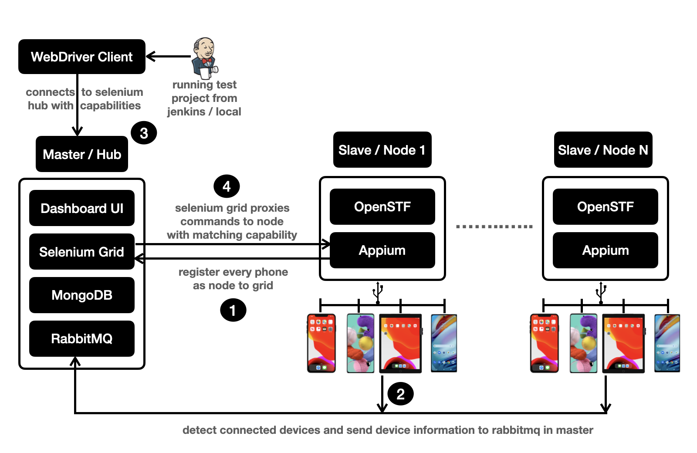

# Lampo v2.0 - The Mobile Device Lab


**Lampo** is developed to run appium mobile automation scripts on mobile devices connected to remote machines. It also aims at allowing users to interact with remotely connected devices for manual testing.

Here, we have a master-slave architecture where anyone can attach their machines as slaves to master and share their devices with anyone within the organisation to use remotely and all the devices are managed centrally by the master application. These attached devices can be used for both automation and manual testing.

> **Note:** Master and Slave can be installed on the same machine or separate machines. It is recommended to have it on separate machines.


### Features

* Use mobile devices for running automated tests using [Appium](https://appium.io/) and [Selenium Grid](https://github.com/SeleniumHQ/selenium/releases/tag/selenium-3.141.59).
* Use mobile devices for manual testing using [OpenSTF](https://github.com/DeviceFarmer/stf). 
* Currently limited to android devices for manual testing.
* Run automated tests on both android and iOS devices.
* Limiting devices to a team and avoid starvation when running automated tests.
* View summary of number of automated test session created by each team and duration	.
* Video recording of test session using [Flick](https://github.com/isonic1/flick).
* Host iOS and android app files from within the application.


### Design



### Install - Master

#### Prerequisites

##### Java 8

Please follow the [link](https://www.oracle.com/java/technologies/javase/javase-jdk8-downloads.html) for installing Oracle JDK 8 or [link](https://adoptium.net/temurin/releases) for AdoptJDK / Temurin.

##### RabbitMQ

Please follow the [link](https://www.rabbitmq.com/download.html) for installing RabbitMQ.

For installation on Mac, run the following commands from terminal:

	brew update
	brew install rabbitmq

For enabling the **rabbitmq** service to run in background in Mac, run the following command:

	brew services start rabbitmq 

Run the following commands to create an user for remote connect:

	rabbitmq-plugins enable rabbitmq_management
	rabbitmqctl add_user connect connect
	rabbitmqctl set_permissions -p / connect ".*" ".*" ".*"
	rabbitmqctl set_user_tags connect administrator


##### MongoDB

Please follow the [link](https://www.mongodb.com/try/download/community) for installing MongoDB Community Server.

For installation on Mac, run the following commands from terminal:

	brew tap mongodb/brew
	brew install mongodb-community

For enabling the **mongodb** service to run in background in Mac, run the following command:

	brew services start mongodb-community

#### Building the Master Application

	cd master && ./gradlew clean build bootWar

#### Running the Master Application

Once the application is built successfully, **`build/libs/master.war`** will be created. Run the following command to start the master application:

	java -jar build/libs/master.war

> **Note:** Make sure **rabbitmq** and **mongodb** services are up and running.

This command can be run in background using the following command:

	java -jar build/libs/master.war > master.log 2>&1 < /dev/null &


#### Overridable Configurations


| Property  | Description  | Default Value  | 
|:-------------:|:-------------:|:-------------:|
|  custom.reap\_sessions.enabled | reaping dead session that are not active or terminated   | false  |
|  custom.max\_session\_duration | maximum run time of each test session in seconds  |  900 |
|  custom.session.wait_timeout | maximum duration of inactivity or idle timeout in seconds before a session is terminated  |  180 |
|  custom.session.polling\_timeout | maximum time to wait for allocation or finding a matching node with given capabilities   | 300  |
|  cron.reap\_long\_running_sessions | cron expresssion for checking long running sessions | */30 * * * * ? |
|  cron.check\_grid\_service | cron expression for checking the health of grid service | */15 * * * * ? |
|  cron.reap\_dead\_sessions | cron expression for checking on the dead or inactive or terminated sessions | */15 * * * * ? |
| custom.upload_dirs | directory to which the apps should be uploaded to when using the uploader | files | 


> **Note:** All the above configurations can be overridden by passing them when launching the application from commandline as well by prefixing **--key=value** or by sending as **JVM argument (-Dkey=value)**.

#### Creating Background Service

##### Mac

```
<?xml version="1.0" encoding="UTF-8"?>
<!DOCTYPE plist PUBLIC "-//Apple//DTD PLIST 1.0//EN" "http://www.apple.com/DTDs/PropertyList-1.0.dtd">
<plist version="1.0">
    <dict>
        <key>Label</key>
        <string>lampo-master</string>
        <key>ServiceDescription</key>
        <string>Lampo Device Lab Master</string>
        <key>UserName</key>
        <string>lampo</string>
        <key>ProgramArguments</key>
        <array>
            <string>/bin/bash</string>
            <string>/usr/local/share/tools/lampo/master/master.bash</string>
            <string>restart</string>
        </array>
        <key>RunAtLoad</key>
        <true />
        <key>KeepAlive</key>
        <true />
        <key>WorkingDirectory</key>
        <string>/usr/local/share/tools/mobile-device-lab/master</string>
    </dict>
</plist>
```

For enabling the service:

```
sudo launchctl load /Library/LaunchDaemons/lampo-master.plist
```

Sample **`master.bash`**

```
echo "--------- starting services ---------"
cd /usr/local/share/tools/mobile-device-lab/master
port=80
lsof -nti:$port | xargs kill -9
session_wait_timeout=900
java -Dserver.port=${port} -Dcustom.session.wait_timeout=${session_wait_timeout} -Dspring.main.allow-circular-references=true -jar master.war
```

##### Linux / Ubuntu

Add the following content in **`/etc/systemd/system/lampo-master.service`**

```
Description=Lampo Device Lab Master 

[Service]
User=root
WorkingDirectory=/usr/local/share/tools/lampo/master
ExecStart=/usr/local/share/tools/lampo/master/master.bash
SuccessExitStatus=143
TimeoutStopSec=10
Restart=always
RestartSec=15

[Install]
WantedBy=multi-user.target
```

For enabling and restarting the service

```
sudo systemctl enable lampo-master
sudo systemctl daemon-reload
sudo service lampo-master restart
```

Sample **`master.bash`**

```
echo "--------- starting services ---------"
cd /usr/local/share/tools/mobile-device-lab/master
port=80
fuser -k ${port}/tcp
session_wait_timeout=900
java -Dserver.port=${port} -Dcustom.session.wait_timeout=${session_wait_timeout} -Dspring.main.allow-circular-references=true -jar master.war
```


### Install - Slave

#### Prerequisites

##### Java 8

Please follow the [link](https://www.oracle.com/java/technologies/javase/javase-jdk8-downloads.html) for installing Oracle JDK 8 or [link](https://adoptium.net/temurin/releases) for AdoptJDK / Temurin.

##### Android SDK

* Install Android Studio from [https://developer.android.com/studio](https://developer.android.com/studio)
* From SDK Manager → SDK Tools, install Android Emulator, Android SDK Platform-Tools, Android SDK Tools
* From AVD Manager → Create New Virtual Device, if required Once this installation is done, Android Studio is not required anymore. It can be removed.

> **Note:** 
> 
> * Make sure **ANDROID_HOME** environment variable is set. To know the path, open Android Studio → Configure (appear on lower bottom corner) → SDK Manager → Copy Android SDK Location
> 
> * Default Location for **ANDROID_HOME** is **/opt/android-sdk** which can by set as a soft link using `sudo ln -s /path/android-sdk /opt/android-sdk`

##### Node Version Manager

Please follow the [link](https://github.com/nvm-sh/nvm) to install nvm or execute the following commands from terminal.

	curl -o- https://raw.githubusercontent.com/nvm-sh/nvm/v0.37.2/install.sh | bash


Depending on the profile file **~/.bash_profile, ~/.zshrc, ~/.profile, or ~/.bashrc**, add the following code in that file:

	export NVM_DIR="$([ -z "${XDG_CONFIG_HOME-}" ] && printf %s "${HOME}/.nvm" || printf %s "${XDG_CONFIG_HOME}/nvm")"
	[ -s "$NVM_DIR/nvm.sh" ] && \. "$NVM_DIR/nvm.sh" # This loads nvm

##### Xcode for iOS Automation

Xcode can be installed from App Store or [https://developer.apple.com/download/]() on your Mac machine.

##### Appium

We will be using node version **14.5.0** for appium installation. 

* For installing node version **14.5.0**, run the following command:

		nvm install 14.5.0 

	> **Note:** 
	> 
	> * Slave application is tested for node version **14.5.0**, but higher version can also be used at own risk. 
	> 
	> * Changing the version of node from **14.5.0** willl require source code change of slave as well in `slave/src/main/resources/scripts/wd-session.bash`.

* For switching to node version 14.5.0, run the following command:

		nvm use --delete-prefix v14.5.0 

* For installing appium, please follow the [link](https://appium.io/docs/en/about-appium/getting-started/) or execute the following commands from terminal:

		npm -g install appium

* **For iOS devices on Mac:**

		brew install ideviceinstaller ios-deploy carthage
		
* **Optional Dependencies for iOS Devices:**

		brew tap facebook/fb
		brew install fbsimctl --HEAD

##### Flick

[Flick](https://github.com/isonic1/flick) offers video recording of mobile device. Run the following command for installing:

	   gem install flick

Flick supports android real devices, android emulators, iOS real devices only. iOS simulators are not supported.

##### OpenSTF


Please follow the link for installing [stf](https://github.com/DeviceFarmer/stf).

For installation on Mac, please run the following commands from terminal:

	brew install rethinkdb graphicsmagick zeromq protobuf yasm pkg-config

For enabling the rethinkdb service to run in background in Mac, run the following command:


	brew services start rethinkdb


For installing **stf**, run the following command;

	nvm use --delete-prefix v8.16.1 
	npm install -g @devicefarmer/stf
		
> Note: Node version **8.16.1** is being used for stf. Please check OpenSTF documentation to check if higher version of node can we used.

#### Building the Slave Application

	cd slave && ./gradlew clean build bootWar

#### Running the Slave Application

Once the application is built, will be created build/libs/remote-slave-app.war. Run the following command to launch and attach the slave to master.

	java -jar build/libs/remote-slave-app.war --master.host=127.0.0.1


#### Creating Background Service

##### Mac

```
<?xml version="1.0" encoding="UTF-8"?>
<!DOCTYPE plist PUBLIC "-//Apple//DTD PLIST 1.0//EN" "http://www.apple.com/DTDs/PropertyList-1.0.dtd">
<plist version="1.0">
    <dict>
        <key>Label</key>
        <string>lampo-slave</string>
        <key>ServiceDescription</key>
        <string>Lampo Device Lab Slave</string>
        <key>UserName</key>
        <string>lampo</string>
        <key>ProgramArguments</key>
        <array>
            <string>/bin/bash</string>
            <string>/usr/local/share/lampo/slave/slave.bash</string>
            <string>restart</string>
        </array>
        <key>RunAtLoad</key>
        <true />
        <key>KeepAlive</key>
        <true />
        <key>WorkingDirectory</key>
        <string>/usr/local/share/tools/lampo/slave</string>
    </dict>
</plist>
```

For enabling the service:

```
sudo launchctl load /Library/LaunchDaemons/lampo-slave.plist
```

Sample **`slave.bash`**

```
echo "--------- starting services -----------"
cd /usr/local/share/tools/lampo/slave
adb kill-server && adb start-server
port=5353
lsof -nti:${port} | xargs kill -9 
java -Dmaster.host=localhost -jar slave.war 
```

##### Linux / Ubuntu

Add the following content in **`/etc/systemd/system/lampo-slave.service`**

```
Description=Lampo Device Lab Slave 

[Service]
User=root
WorkingDirectory=/usr/local/share/tools/lampo/slave
ExecStart=/usr/local/share/tools/lampo/master/slave.bash
SuccessExitStatus=143
TimeoutStopSec=10
Restart=always
RestartSec=15

[Install]
WantedBy=multi-user.target
```

For enabling and restarting the service

```
sudo systemctl enable lampo-slave
sudo systemctl daemon-reload
sudo service lampo-slave restart
```

Sample **`slave.bash`**

```
echo "--------- starting services -----------"
cd /usr/local/share/tools/lampo/slave
adb kill-server && adb start-server
port=5353
fuser -k ${port}/tcp
java -Dmaster.host=localhost -jar slave.war 
```

### Creating Background Service for STF

Refer to the background service creation of master/slave and just change the script file to the following:

Sample **`stf.bash`**

```
node_version="14.5.0"

ip=localhost
quality=10

ps -ef | grep stf | grep -v bash | grep -v grep | awk '{print $2}' | tr -s '\n' ' ' | xargs kill -9

nvm use --delete-prefix v$node_version --silent
export SCREEN_JPEG_QUALITY=$quality
stf local --cleanup false --public-ip $ip
``` 

	
### Configurations

#### Adding new configuration

`BASE_URL - http://localhost:80`

For restricting devices by team, add the following: 

```
curl -iX POST 'BASE_URL/team' --header 'content-type: application/json' \
--data '{
    "name" : "common",
    "jobs": {
    	"job_name": [ "device-udid" ]
    },
    "devices" : {
        "android" : [ 
            "device-udid"
        ],
        "ios" : [ 
            "device-udid"
        ]
    }
}' 
```

`jobs` is optional, to restrict the devices to a team and a specific job. 

`device-udid` supports **regex** also.

#### Deleting a team configuration

```
curl -iX DELETE 'BASE_URL/team/<team-name>'
```


### Usage - Creating Appium Driver

Custom Capabilities that needs to be additionally added.

| Capability  | Description | 
|:-------------:|:-------------:|:-------------:|
|  realDevice |  to allocate real device or emulator (for android) or simulator (for ios)  |
|  deviceName |  finding a matching device with the given name  |
|  platformVersion |  finding a matching device with the given platform version  |
|  clearUserData |  clear user data from the matched device identified by given package or bundle id   |
|  udid |  finding a matching device with the given udid (device unique id)  |
|  brand | finding a matching device with the given brand |
|  session.wait_timeout |  maximum timeout for finding a matching device  |
|  ci.user |  requestor name  |
|  ci.requestor_ip |  requestor IP  |
|  ci.team_name | requestor team name that should match the configured   |
|  ci.job_link |  CI job name (like jenkins job name using environment variable **BUILD_URL**)  |
|  session.request_id |  requestor unique request ID  |
|  session.record_video |  whether to record the video using Flick  |


#### Creating Appium Driver (AndroidDriver or IOSDriver)

	URL url = http://LAMPO_HOST:4444/wd/hub
	AppiumDriver<MobileElement> driver = new AppiumDriver<>(url, capabilities)
	
> **Note:** **4444** is selenium grid port

Appium logs will be present at, **`http://LAMPO_HOST/device/logs/<request-id>`**

Incase video recording is enabled (using capability *session.record_video* is set to *true*) for the test session, video will be present at, **`http://LAMPO_HOST/device/videos/<request-id>`**

### Dashboard

Once both the applications are started successfully, open http://localhost to view the dashboard that displays the connected devices. If no slaves is connected to the master or slave(s) is connected but no devices are connected to the slave, then **"No Device Available"** wil be shown.

This page automatically refreshes every 5 seconds.


* From the dashboard, we can upload and host the app and view them as well.
* Dashboard shows all the devices connected across the slave machines.
* Each device shows which team the device belongs to.
* Incase there is any active test session using the connected device, it will be grayed out and the job link will be showing up along with the jenkins slave machine IP and the username.
* Incase if someone accessing OpenSTF of any device, the person's name will be showing up.


### APIs for Fetching Summary

* For finding the summary on a specific date

		curl BASE_URL/summary/find?date=10-05-2022

* For finding the summary between specific dates

		curl BASE_URL/summary/find_between?start=10-05-2022&end=16-05-2022

* For finding the total summary between specific dates

		curl BASE_URL/summary/total_between?start=10-05-2022&end=16-05-2022

### Troubleshooting

* Make sure master and slave ports are able to communicate with each other.
* Sometime devices on STF becomes inaccessible, restart the STF service in that case.
